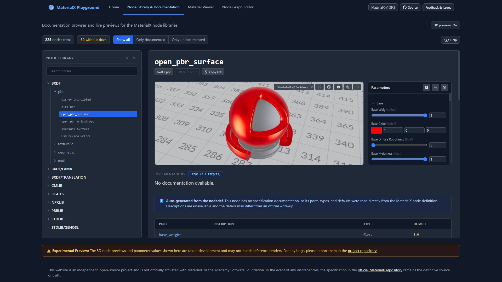
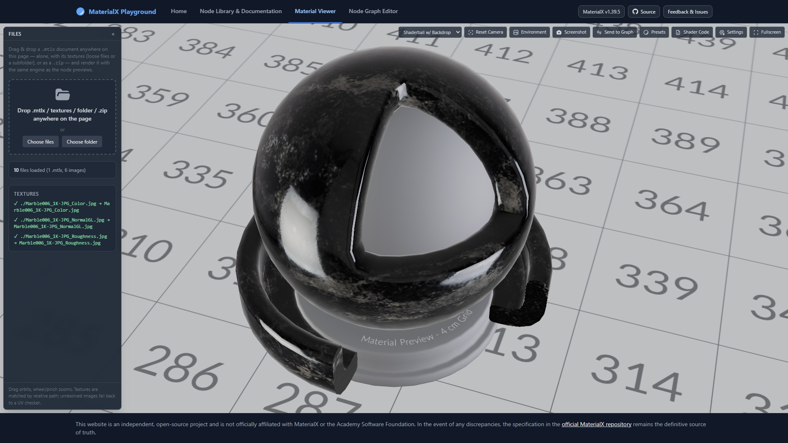
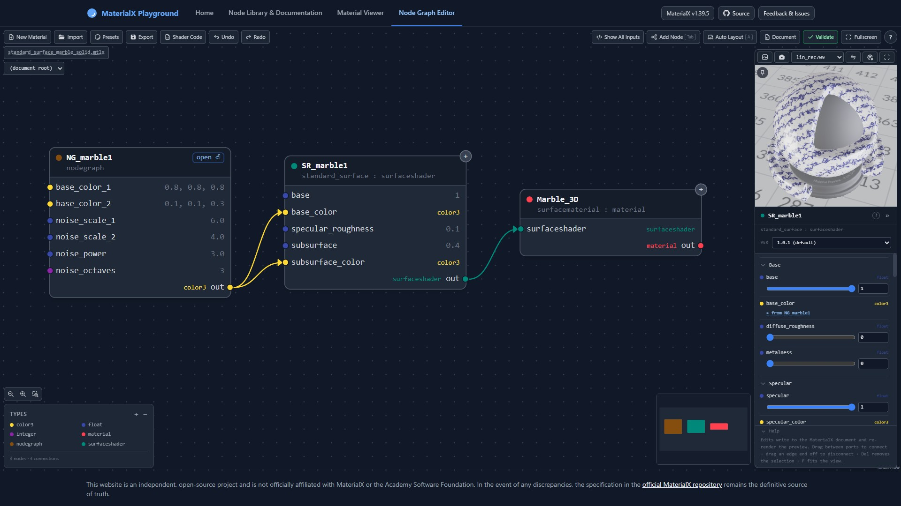

# MaterialX Playground

MaterialX Playground is a set of tools for in-browser interactive visualization of the standard node library, preview materials in real-time 3D, and build node graphs visually, all without installing anything. Everything runs 100% client-side: no server, no account, no data leaves your browser. Shaders are generated and compiled live in your browser through the MaterialX WebAssembly modules.

> This is an independent community project. It is **not affiliated with, endorsed by, or sponsored by** the [MaterialX](https://materialx.org/) project, the Academy Software Foundation, or the Linux Foundation. In case of any discrepancy, the [MaterialX specification](https://github.com/AcademySoftwareFoundation/MaterialX/tree/main/documents/Specification) is the definitive source of truth. See [Trademarks](#trademarks) below.

Built on the MaterialX v1.39.5 WebAssembly modules (core and shader generation).

---

## Features

### 📖 Node Library & Documentation



A searchable, browsable reference for the entire MaterialX standard node library.

- **Every standard node**, organized by library (`stdlib`, `pbrlib`, `bxdf`, and more) and group (`npr`, `pbr`, etc.).
- **Per-signature documentation.** Nodes with multiple type signatures are shown individually, so you see exactly the inputs, outputs, and defaults of the variant you are searching for.
- **Port tables** generated directly from the node definitions (names, types, defaults, descriptions), with prose pulled from the MaterialX specification where available and reconstructed from the `nodedef`s where it isn't.
- **Live 3D preview** of each node, with editable parameters so you can see how inputs affect the result in real time.
- **Implementation-target matrix** showing which render targets (GLSL, ESSL, MSL, Slang, OSL, MDL) each node supports, including coverage inherited through target inheritance (e.g. MSL/Slang/ESSL falling back to the GLSL implementation), distinguished from explicit per-target overrides.
- **Shareable permalinks.** Every node has its own URL (`index.html#/<library>/<group>/<node>`), so you can link straight to a specific node's docs.
- **Export and hand-off.** Export any node (with your edited values) as a `.mtlx` document, or send it straight into the Node Graph Editor.

### 🖼️ Material Viewer



Load and inspect MaterialX materials in 3D.

- **Image-based lighting** from a built-in HDR environment (always on). A toggle shows or hides that environment as the visible backdrop; the lighting itself is unaffected either way.
- **Drag-and-drop loading.** Drop a `.mtlx` document anywhere on the page, on its own or together with loose textures, a folder of textures, or a `.zip`. Textures are matched by relative path, with a UV-checker fallback for anything unresolved.
- **Interactive viewport** with orbit (drag) and zoom (wheel/pinch), an optional turntable rotation, selectable preview geometry (shaderball / sphere / cube), a material picker when a document defines several, a save-PNG-preview button, and fullscreen.
- **Send to editor** to keep working on the current material in the Node Graph Editor.

### 🕸️ Node Graph Editor



Build MaterialX node graphs visually.

- **Drag-and-drop graph editing** built on React Flow, with an add-node search (filterable by type) and automatic wiring.
- **Quick insert from a wire.** Drag a connection from any port and release it over empty canvas to pick a compatible node, pre-filtered and wired up automatically.
- **Nested nodegraphs.** Enter and edit nodegraph scopes with breadcrumb navigation back out, and group the current selection into a new nodegraph in one step.
- **Undo/redo** across edits, including structural ones.
- **Live 3D preview** of the selected node or output, with a pin option to freeze the preview on a specific node while you work elsewhere.
- **Copy/paste** that preserves the relative arrangement of a group of nodes.
- **One-click automatic layout** of the current graph.
- **Document colorspace picker**, setting the fallback colorspace for inputs that don't author their own.
- **Non-destructive disconnects.** Removing a connection or deleting an upstream node restores the input's previous literal value where possible, and falls back to the definition default otherwise.
- **Document view** to inspect the generated MaterialX XML with syntax highlighting, and copy it.
- **Validate** the current document and see errors and warnings.
- **Import/export** `.mtlx`, including materials handed off from the docs previewer or the Material Viewer.

---

## Getting started

A fresh clone is immediately servable — the committed tree **is** the complete, runnable site. The app code itself has no build step (the `.jsx` sources are transformed in the browser by Babel Standalone; there is no bundler or transpile-on-disk), and every *derived* artifact — the vendored third-party libraries, the pre-generated node-library data, the extracted MaterialX version — is committed to the repo. You only need the build tooling when you change one of those inputs; see [How this repo is built](#how-this-repo-is-built). To run the site, just serve the clone over HTTP (opening `index.html` directly via `file://` won't work, because the app fetches its `.jsx`, WASM, and library files). You'll need a WebGL2-capable browser.

Any static file server works, for example:

```bash
# Python 3
python -m http.server 8000

# or Node (fetches the `serve` package from npm on first use, so that
# first run needs network access — the Python command above doesn't)
npx serve .
```

Then open <http://localhost:8000/>.

> **Maintainers:** day-to-day app-code edits need no tooling at all — edit a `.jsx`/`.js` file and reload. The build pipeline (`npm run build` / `npm run check`) only comes into play when a *generated input* changes; see [How this repo is built](#how-this-repo-is-built) below.

### URLs / routing

The app is a hash-routed single page:

| View | URL |
| --- | --- |
| Home | `index.html` (or `#!home`) |
| Node Library & Documentation | `index.html#!docs` (deep links: `#/<library>/<group>/<node>`) |
| Material Viewer | `index.html#!viewer` |
| Node Graph Editor | `index.html#!graph` |

### Debugging

Verbose console output is off by default. Two opt-in flags can be set in the browser console (reload afterwards):

```js
localStorage.setItem('mtlxDebugShaders', '1'); // log generated GLSL, uniforms, and preview documents
localStorage.setItem('mtlxPerfLog', '1');      // log graph-editor timing (scope builds, layout, previews)
```

Remove the keys (`localStorage.removeItem(...)`) and reload to turn them off again.

---

## How this repo is built

The repo follows a **committed-artifact model**: every generated file is checked in, so *consumers* (a fresh clone, the deployed site, the VS Code extension) never run a build — only *contributors who change an input* do, and CI proves the two never drift. The invariant is:

> The committed tree is always the complete, runnable artifact. `npm run build` regenerates all derived state byte-for-byte, and `npm run check` (also run in CI) fails if anything has drifted.

`npm run build` runs `scripts/build.mjs`, which sequences five steps — each also available individually, and each with a read-only `--check` mode:

**1. `version` (`scripts/extract-mtlx-version.mjs`)** — the MaterialX version is never hand-typed anywhere in this repo. This step instantiates the vendored WebAssembly module under Node, calls its `getVersionString()`, and writes the result to `js/gen/mtlx-version.json` (`{version, tag, versionIntegers}`). It then *stamps* the few places that need the value as a literal (the header badge fallback in `js/site-header.js`, `js/mtlx-assets.js`, and two lines of this README — which is why those version strings must not be edited by hand). Node-side consumers (`scripts/vendor.mjs`, the VS Code extension's `specDocs.js`) read the JSON directly. Swapping in a new WASM build and running `npm run build` propagates the new version everywhere; `--check` re-extracts from the WASM and fails on any disagreement.

**2. `vendor` (`scripts/vendor.mjs`)** — collects the third-party runtime libraries from `node_modules` (versions pinned in `package.json` devDependencies) into the committed `vendor/` folder, along with each package's license file, and records every file's sha256 in `vendor/vendor-manifest.json`. The one direct download is the Tailwind Play build (plus its license), fetched by URL and verified against a pinned sha256. `npm run vendor:offline` (or `--with-materialx`) additionally snapshots MaterialX spec/example/texture content from GitHub at the pinned tag into `vendor/materialx/` — gitignored, produced on demand — which flips the app (and the nodelib build below) into fully offline, zero-network operation. `--check` verifies the manifest's path set and hashes against both the on-disk files and the current `node_modules` sources.

**3. `nodelib` (`scripts/build-nodelib.mjs`)** — pre-parses the entire node-library documentation dataset so the docs view never has to. Under Node it instantiates the MaterialX WASM once, loads the standard libraries, fetches and parses the three specification markdown files (from `vendor/materialx/` when present, otherwise from GitHub at the pinned tag), and walks every nodedef, implementation, and nodegraph to produce two committed files:

- `js/gen/nodelib.json` — per-node spec prose and port tables (descriptions, notes, references, spec permalinks), joined from the parsed specification and the nodedef walk.
- `js/gen/nodelib-index.json` — per-node signature groups (types, versions, defaults), auto-generated port tables for undocumented nodes, fallback port listings, and the implementation-target matrix (including target inheritance), plus the global target list.

The docs view fetches these two JSONs instead of parsing anything live — browsing the node library is fully WASM-free (the ~3.7 MB engine now loads only if 3D previews are enabled). Generation is deterministic (stable serialization, no timestamps) and finishes with sanity assertions (node counts, schema shape, spot-checks like `standard_surface`'s signatures); `--check` regenerates both files in memory and fails on any byte difference from the committed copies.

**4. `tutorials` (`scripts/build-tutorials.mjs`)** — builds the MkDocs-based tutorials subsite from `tutorials-src/` into the committed `/tutorials/` directory. This step activates automatically when `tutorials-src/mkdocs.yml` exists in the checkout and is skipped otherwise (the tutorials currently live on a separate branch; requires a pip-installed `mkdocs-material`, pinned in `tutorials-src/requirements.txt`).

**5. `webview` (`scripts/build-webview.mjs`)** — regenerates `vscode_extension/media/webview.html` from `index.html`. The VS Code extension's webview needs the exact same `<head>`/`<body>` skeleton as the real site plus a handful of webview-only insertions (a Content-Security-Policy meta tag, a `<base>` tag, a bootstrap `<script>` tag, and a focus-outline CSS rule VS Code's Chromium needs but a real browser doesn't) — this step splices those fragments into a copy of `index.html` at two content-based anchors, so the mirror can never silently drift out of sync with the real site. `--check` fails on any byte difference from the committed file.

**Verification and deployment.** `npm run check` runs every step's `--check` without writing anything. CI (`.github/workflows/deploy.yml`) runs on every push and pull request to `main`: it does a clean `npm ci && npm run build`, requires the rebuilt tree to be **byte-identical to the commit** (a stale committed artifact fails the run with instructions to rebuild), then runs `npm run check` — and only after all of that does a push to `main` deploy to GitHub Pages. A broken or stale build never deploys.

**When to run what:**

| You changed... | Run |
| --- | --- |
| App code (`js/**.jsx`, CSS, HTML) | nothing — reload the browser |
| A pinned dependency version in `package.json` | `npm install && npm run build:vendor` |
| The vendored WASM modules (`js/JsMaterialX*`) | `npm run build` (re-extracts the version, re-stamps, regenerates the nodelib data) |
| `libraries/` or anything affecting node docs | `npm run build:nodelib` |
| Tutorial content (`tutorials-src/`) | `npm run build:tutorials` |
| `index.html` structure or webview-only fragments (`scripts/build-webview.mjs`) | `npm run build:webview` |
| Not sure | `npm run build` then `npm run check` — it's all idempotent |

---

### The standard library, spec data, and WASM modules

**`libraries/`** vendors the MaterialX standard library (`stdlib`, `pbrlib`, `bxdf`, `cmlib`, `lights`, `nprlib`, `targets`), which the WASM loads to resolve node definitions, implementations, and target inheritance.

**`js/JsMaterialXCore*` and `js/JsMaterialXGenShader*`** (`.js`/`.wasm`/`.data`, v1.39.5) are the MaterialX WebAssembly modules themselves, obtained from the official MaterialX build and committed manually. They predate, and are not managed by, `scripts/vendor.mjs` — but they are the **single source of truth for the MaterialX version**: the build's `version` step extracts it from the module at build time and every other occurrence in the repo is generated or stamped from that (see [How this repo is built](#how-this-repo-is-built)).

**`models/`** ships two user-authored shaderball GLBs, committed in-repo (no download/vendoring step): `shaderball.glb`, the full scene used by the Node Graph Editor's live preview (backdrop, grid, emissive panels, and an embedded camera), and `shaderball_simple.glb`, a plain ball used by the Material Viewer and docs previews. In both, the generated MaterialX material is applied only to the mesh named `material_surface`; every other mesh keeps its authored glTF material.

---

## Tech stack

- [MaterialX](https://github.com/AcademySoftwareFoundation/MaterialX) (WebAssembly build: core + GenShader)
- [React 18](https://react.dev/) (UMD) + [Babel Standalone](https://babeljs.io/docs/babel-standalone) (in-browser JSX)
- [three.js](https://threejs.org/) for the 3D previews
- [React Flow](https://reactflow.dev/) for the node graph editor, with [dagre](https://github.com/dagrejs/dagre) for automatic layout
- [Tailwind CSS](https://tailwindcss.com/) (vendored Play build) for styling
- [KaTeX](https://katex.org/) for math in the docs, [highlight.js](https://highlightjs.org/) for XML highlighting, [JSZip](https://stuk.github.io/jszip/) for zipped texture sets

All third-party JS/CSS libraries are vendored: `npm run vendor` installs pinned versions from npm (see `package.json` devDependencies) and copies the needed dist files (and licenses) into a committed `vendor/` folder, served locally alongside the app — no CDN requests at runtime. The one direct download is the Tailwind Play build, fetched by URL and verified against a pinned sha256. MaterialX *example/preset/texture* content is the one runtime exception: the web app fetches it from `raw.githubusercontent.com` on demand unless a local `vendor/materialx/` snapshot is present, in which case it's read from disk instead and the app performs zero network access (see `js/mtlx-assets.js`). A packaged offline build ships that snapshot. The specification markdown itself is no longer fetched by the web app at all — it's parsed at build time into the committed `js/gen/` node-library data (the VS Code extension's hover docs still fetch spec files remotely, vendor-snapshot-first).

---

## Contributing

Issues and pull requests are welcome. Please file bugs and feature requests via the [issue tracker](https://github.com/joaovbs96/MaterialXPlayground/issues).

## License

Released under the [Apache License 2.0](LICENSE). The MaterialX standard libraries vendored under `libraries/` are © the Academy Software Foundation and its contributors, also under the Apache License 2.0.

## Trademarks

MaterialX™ is a trademark of the Academy Software Foundation, a project of the Linux Foundation. All other trademarks are the property of their respective owners.

References to MaterialX in this project are nominative and descriptive only, used to identify the technology this tool works with. This project is **not affiliated with, endorsed by, or sponsored by** the MaterialX project, the Academy Software Foundation, or the Linux Foundation. This project does not use the MaterialX logo, and nothing here should be read as implying any official status. Where this document and any policy published by the Academy Software Foundation differ, the Foundation's policy governs.
