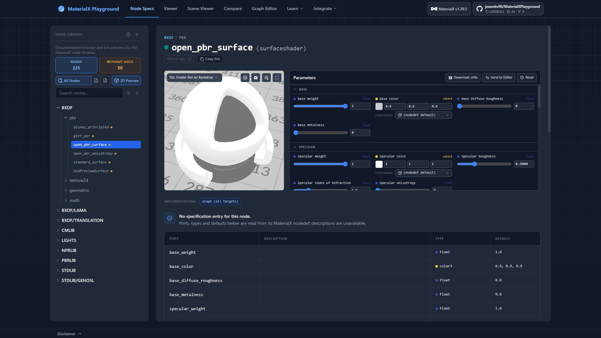
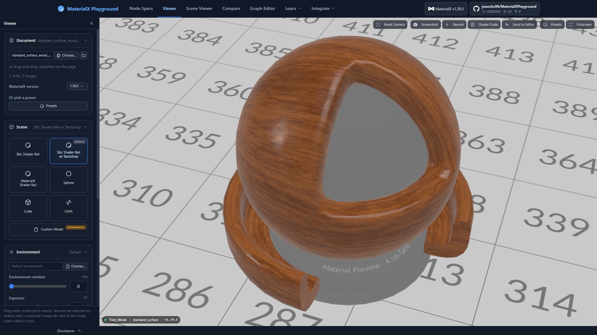
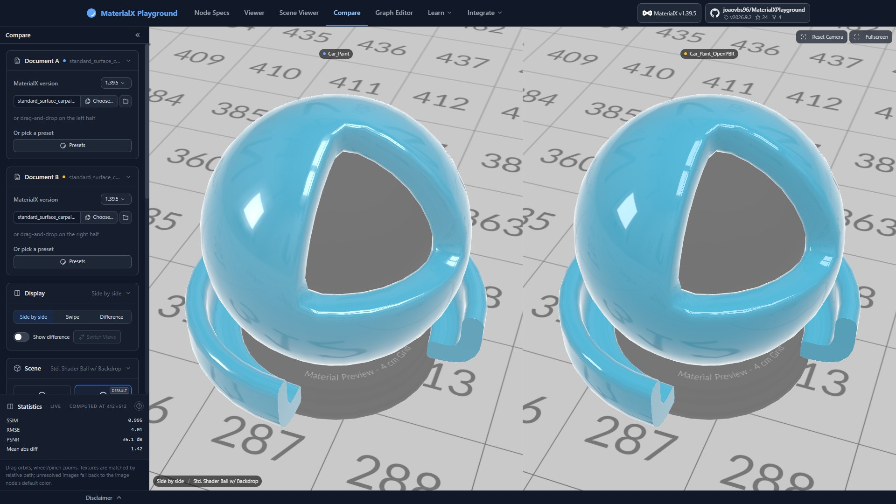
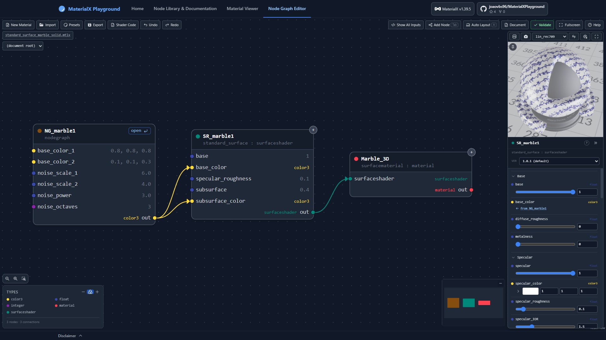

# MaterialX Playground

[](https://github.com/joaovbs96/MaterialXPlayground/actions/workflows/deploy.yml) [](LICENSE) [![MaterialX](https://img.shields.io/badge/MaterialX-v1.39.5-blue?logo=data:image/png;base64,iVBORw0KGgoAAAANSUhEUgAAAGEAAAA4CAMAAADaWWauAAAAQlBMVEVHcEz%2F%2F%2F%2F%2F%2F%2F%2F%2F%2F%2F%2F%2F%2F%2F%2F%2F%2F%2F%2F%2F%2F%2F%2F%2F%2F%2F%2F%2F%2F%2F%2F%2F%2F%2F%2F%2F%2F%2F%2F%2F%2F%2F%2F%2F%2F%2F%2F%2F%2F%2F%2F%2F%2F%2F%2F%2F%2F%2F%2F%2F%2F%2F%2F%2F%2F%2F%2F%2F%2F%2F%2F%2F%2F%2F%2F%2F%2F%2F%2F%2F%2F%2F%2F1bZCPAAAAFXRSTlMAeOfxAQIF%2FfX6jMizHjJGENqdWGkkbYMPAAADoElEQVRYw7VY23LjIAzFwY6Q06ZJGv3%2Fry43YwRIdjqznT40oeggHd2N2X%2BWxVyn248x19n85We%2BGvNzm65B0PB8CedE8Pr2YH8A8He%2BXwgU3rjMw%2FP7FxE6Ijc9It5n8hfzmCyRRaKve%2F9G%2F%2FmxOgIAJCB6%2FhpJVSMa4PfpDQDOyyC3PjiGF7a8w7n%2FxfBvJKoqEhAMEC46iHIu74qORFA6jwjpz%2FN0RAIg3Y8IzRvjeZa%2FIcSP9hwd0QMv8eEFIYkrdASCsvwdgQod80kCiCHEbyIdZvl9FnyGUJ6hRMe87AS0CIUOfl4jpGdodAQDr8ju1wiJDmNd%2FR1HILSOLlKQBgLel9oALULAAHPxQeaGViIIB1ago6QADtAg%2BAj0CCGQsUfw8kNs2DEdPQECgvMIsEljCBkVbBSDK6MjpgAcyPdv5t9BRsgW2RGK5QJC8oqdjjEBug5Z6IYAOzMJIXlFokMiYIwAFUIyTMh8zlVBYdvokAg41iGTi7X8CqHQkXKwID%2Fk1t6XWDjY5nqFkOhYnwIB%2BR90HbwSsK5QYzAEii9UFCBa1zYCGYLzZE%2FczAzBEwWqfJ%2Bx34QiQnAmoGlLlj0PXj6RYqAY%2B5OIkDwUvQ7XXHGB%2B5JzmvxcTq5GQtjuR4S6KG0I6FCVn0uiiFDuJ4SqsCaEQ%2FlbyRwj5GiuEVKnEehAe4aA95wzyhCBGbggxCc9JuczGWoEBBnrXs%2BHCOx9FULuEaxmoJDHWBEcIjgVYUVVAW%2FgAwSrWCl0KVa1T7iKrAntEMAmprFDmHngCQr4e8ia0KEOMV0NvFXN0bsHI%2Bt6xjoIEYeq%2FGJbTBEBUsTt2RvrrFG3iap8yvL8p5A1FjlrlBKXMt%2FtlIEqhDOZL72sy959igCeQrBpQrXsvVUg1GtME%2BLITuGgAqUqqhbJroriR1U0dgKaAsFjml6YIyCqCLmbkQ006maQyYeDjgxIRNjnlZk7GzL5ipVKyKEgP7r70s9Vpc%2FNKfJ8Zzwsknw4T661KaD0fDz1oVQkWXe%2FJy5k8scI4oTCCFiEEdFtBIgIzZTV6KANvbmANP7ZT1kHkyIdTYqvw0mxmTUQdQLkdUM%2FA%2BVp1%2FB2nU%2FspUvRNgK8FvYTezPzIbLzM1uHmW0V2q3D3M6t1ebk%2FtHmhOTNCR%2F9%2Frz92d442v4MNliX9%2FLZBmunI26wmuGY7UDiFq7dcJ3CmOMbyxZu4IEbHcMt3flFFmoG%2Fj%2Fb0H%2BoyQV84EOiGQAAAABJRU5ErkJggg%3D%3D)](https://github.com/AcademySoftwareFoundation/MaterialX)

MaterialX Playground is a set of in-browser tools to explore the standard MaterialX node library, preview materials in real-time 3D, compare them side by side, and build node graphs visually, all without installing anything. Everything runs 100% client-side: no data leaves your browser. Shaders are generated and compiled live through the MaterialX WebAssembly modules.

> This is an independent community project. It is **not affiliated with, endorsed by, or sponsored by** the [MaterialX](https://materialx.org/) project, the Academy Software Foundation, or the Linux Foundation. In case of any discrepancy, the [MaterialX specification](https://github.com/AcademySoftwareFoundation/MaterialX/tree/main/documents/Specification) is the definitive source of truth. See [Trademarks](#trademarks) below.

## Try it live

**[joaovbs96.github.io/MaterialXPlayground](https://joaovbs96.github.io/MaterialXPlayground/)**. You'll need a WebGL2-capable browser; it works best on desktop.

## Features

### 📖 Node Library & Documentation



A searchable, browsable reference for the entire MaterialX standard node library.

- **Every standard node**, organized by library (`stdlib`, `pbrlib`, `bxdf`, and more) and group (`npr`, `pbr`, etc.).
- **Per-signature documentation.** Nodes with multiple type signatures are documented individually, with the exact inputs, outputs, and defaults of each variant.
- **Port tables** generated directly from the node definitions (names, types, defaults), with descriptions pulled from the MaterialX specification where available and reconstructed from the `nodedef`s otherwise.
- **Live 3D preview** of each node, with editable parameters so you can see how inputs affect the result in real time; translation nodes preview a swipe comparison against their source shading model.
- **Implementation-target matrix** showing which render targets (GLSL, ESSL, MSL, Slang, OSL, MDL) each node supports, distinguishing explicit per-target implementations from ones inherited from GLSL, with a view of nodegraph implementation sources.
- **Shareable permalinks.** Every node has its own URL (`index.html#/<library>/<group>/<node>`), so you can link straight to a specific node's docs, e.g. [`#/bxdf/pbr/standard_surface`](https://joaovbs96.github.io/MaterialXPlayground/index.html#/bxdf/pbr/standard_surface).
- **Export and hand-off.** Export any node (with your edited values) as a `.mtlx` document, or send it straight into the Node Graph Editor.

### 🖼️ Material Viewer



Load and inspect MaterialX materials in 3D.

- **Image-based lighting** from a built-in HDR environment, with automatic key-light extraction (a strong sun in the image becomes a sharp analytic directional light, toggleable) and a toggle to show or hide the environment as the visible backdrop (the lighting stays on either way).
- **Drag-and-drop loading.** Drop a `.mtlx` document anywhere on the page, alone or with loose textures, a folder of textures, or a `.zip`. Textures are matched by relative path, with a UV-checker fallback for anything unresolved.
- **Curated examples.** Load official MaterialX example materials, textures included, plus the Playground's own examples (currently an animated, time-driven noise material), from a built-in presets list.
- **Interactive viewport** with orbit and zoom, optional turntable, selectable preview geometry (the Standard Shader Ball, the Shader Ball used by official MaterialX viewers, a 2D buffer view, a sphere, a cube, or a draped cloth mesh), a material picker when a document defines several, save-as-PNG, and fullscreen.
- **Send to Graph Editor** to keep working on the current material in the Node Graph Editor.
- **Animated materials.** `time` and `frame` nodes are driven the way MaterialXView drives them: seconds since the page loaded and a per-frame counter, shared by every view so the Compare panes stay in lockstep. Both reach the shader as 32-bit floats, so after a couple of days with the same page open the animation timing gets coarser; reloading the page resets it.

### 🔀 Material Compare



Render two MaterialX materials side by side and see exactly where they differ.

- **Two independent documents**, loaded the same way as the Material Viewer — drag-and-drop (a single `.mtlx`, a `.zip`, or loose files) or file/folder pickers — one per side, with identical camera and lighting.
- **Per-pane MaterialX version.** Each side can render through its own vendored MaterialX version, so you can see exactly what a document looks like under one MaterialX release versus another.
- **Three display modes**: side by side, a swipe slider, and a difference heatmap. A **Show difference** checkbox adds the difference as a third pane in side-by-side mode, or into either half of the slider (**Switch Views** swaps which side it takes).
- **GPU difference rendering** that updates live while orbiting: a per-pixel absolute color difference, log-scaled through a false-color ramp.
- **Live statistics** — SSIM, RMSE, PSNR, and mean absolute difference — recomputed automatically as the camera, documents, or environment change.
- **Synced cameras** and shared environment controls (import `.hdr`/`.exr`, rotation, exposure, background) and geometry selection, so both renders stay lit and framed identically.

### 🕸️ Node Graph Editor



Build MaterialX node graphs visually.

- **Drag-and-drop graph editing** built on React Flow, with an add-node search (filterable by type), automatic wiring, and keyboard shortcuts throughout.
- **Quick insert from a wire.** Drag a connection onto empty canvas to pick a compatible node, pre-filtered and wired up automatically.
- **Nested nodegraphs.** Enter and edit nodegraph scopes with breadcrumb navigation, group a selection into a new nodegraph in one step, or dissolve one back into its nodes.
- **Undo/redo** across edits, including structural ones.
- **Live 3D preview** of the selected node or output, with a pin option to freeze the preview on a specific node while you work elsewhere.
- **Copy/paste** that preserves the nodes' relative arrangement.
- **One-click automatic layout** of the current graph.
- **Document colorspace picker**, setting the working colorspace of the document.
- **Non-destructive disconnects.** Removing a connection or deleting an upstream node restores the input's previous value, or the definition default.
- **Document view** to inspect the generated MaterialX XML with syntax highlighting, and copy it.
- **Validate** the current document and see errors and warnings.
- **Import/export** `.mtlx`, with a `.zip` export option that bundles the textures used. Start from an empty document, a curated official example, or a material handed off from the docs pages or the Material Viewer.
- **Cross-links.** Open the current material in the Material Viewer, or jump from any node to its documentation page.

## Running locally

A fresh clone is the complete, runnable site: there is nothing to build or install. Just serve the folder with any static file server:

```bash
# Python 3
python -m http.server 8000

# or Node
npx serve .
```

Then open <http://localhost:8000/>. Serving over HTTP is required; opening `index.html` via `file://` won't work, because the app fetches its `.jsx`, WASM, and library files.

Development works the same way: edit a `.jsx`/`.js` file and reload. Sources are transformed in the browser by Babel Standalone, and every derived artifact (vendored libraries, pre-generated node-library data) is committed. Build tooling is only needed when you change one of those generated inputs; see [Generated files](#generated-files).

### URLs / routing

The app is a hash-routed single page:

| View | URL |
| --- | --- |
| Home | `index.html` (or `#!home`) |
| Node Library & Documentation | `index.html#!docs` (deep links: `#/<library>/<group>/<node>`) |
| Material Viewer | `index.html#!viewer` |
| Material Compare | `index.html#!compare` |
| Node Graph Editor | `index.html#!graph` |
| VS Code extension | `index.html#!vscode` |

### Debugging

Verbose console output is off by default. Two opt-in flags can be set in the browser console (reload afterwards):

```js
localStorage.setItem('mtlxDebugShaders', '1'); // log generated GLSL, uniforms, and preview documents
localStorage.setItem('mtlxPerfLog', '1');      // log graph-editor timing (scope builds, layout, previews)
```

Remove the keys (`localStorage.removeItem(...)`) and reload to turn them off again.

## VS Code extension (experimental)

The playground also ships as a VS Code extension: opening a `.mtlx` file brings up the Node Graph Editor and Material Viewer beside the text editor, with edits synced live in both directions, plus in-editor validation diagnostics, hover documentation for node types, and the node library documentation as its own panel.

> ⚠️ **Early, experimental release.** The extension is a work in progress and hasn't had wide testing yet — things may not be 100%, so expect rough edges and please report anything broken on the [issue tracker](https://github.com/joaovbs96/MaterialXPlayground/issues). It is currently distributed only as a `.vsix` file on the releases page (not the Visual Studio Marketplace) and does not auto-update.

### Install

Requires VS Code 1.85 or newer.

1. Download the `.vsix` asset (named like `materialx-playground-vscode-v2026.8.3.vsix`) from the [VS Code extension page](https://joaovbs96.github.io/MaterialXPlayground/#!vscode) or the [latest release](https://github.com/joaovbs96/MaterialXPlayground/releases/latest).
2. Install it either way:
   - **VS Code UI:** Extensions view → `···` (Views and More Actions) menu → **Install from VSIX…** → pick the downloaded file. Equivalently, run **"Extensions: Install from VSIX…"** from the Command Palette, or just drag the `.vsix` file onto the Extensions view.
   - **Command line:** `code --install-extension path/to/materialx-playground-vscode-<version>.vsix`
3. Open any `.mtlx` file — the playground opens beside the text editor automatically (configurable via the `materialx.*` settings). All commands are under "MaterialX Playground:" in the Command Palette, including the standalone node documentation browser.

The packaged extension is fully self-contained: it bundles the MaterialX libraries, curated examples, and spec content, and performs no network requests.

### Update / uninstall

There are no auto-updates: to update, download the `.vsix` from a newer release and install it over the existing one the same way. To uninstall, remove "MaterialX Playground" from the Extensions view, or run `code --uninstall-extension local.materialx-playground`.

## Embedding (experimental)

Drop a single material into any other web page as a lightweight, chromeless viewer, the same idea as embedding a YouTube video. The easiest way to start is the **Embed Builder** on the home page: configure the embed against a live preview and copy a ready-made snippet.

- **Two ways to embed**: a plain `<iframe>` configured entirely through the query string (no JavaScript needed), or the `<materialx-viewer>` custom element, one `<script>` tag with an HTML attribute API. The element also lazy-loads and caps how many viewers run at once, which matters for pages showing many materials.
- **Everything is configurable**: document URL, geometry, which material to show, initial camera, environment map, lighting, auto-rotate, an opt-in HUD, transparent backgrounds, theming, and the MaterialX version.
- **Sane defaults for someone else's page**: plain scrolling reaches the host page (zoom is Ctrl/Cmd+wheel), reduced-motion settings pause auto-rotate, and configuration mistakes fall back safely and report through an event instead of failing silently.
- **Self-hostable**: the offline release zip ships everything the embed needs.

See [docs/EMBEDDING.md](docs/EMBEDDING.md) for the full reference: every query parameter and attribute, the element's methods and events, loading documents the embed can't fetch itself, performance notes, and self-hosting instructions.
## Tech stack

- [MaterialX](https://github.com/AcademySoftwareFoundation/MaterialX) (WebAssembly build: core + GenShader)
- [React 18](https://react.dev/) (UMD) + [Babel Standalone](https://babeljs.io/docs/babel-standalone) (in-browser JSX)
- [three.js](https://threejs.org/) for the 3D previews
- [React Flow](https://reactflow.dev/) for the node graph editor, with [dagre](https://github.com/dagrejs/dagre) for automatic layout
- [Tailwind CSS](https://tailwindcss.com/) (vendored Play build) for styling
- [KaTeX](https://katex.org/) for math in the docs, [highlight.js](https://highlightjs.org/) for XML highlighting, [JSZip](https://stuk.github.io/jszip/) for zipped texture sets

All third-party JS/CSS libraries are vendored into a committed `vendor/` folder (pinned versions, refreshed via `npm run vendor`), so the app makes no CDN requests at runtime. The one runtime exception is MaterialX example/preset/texture content, fetched from `raw.githubusercontent.com` on demand. If a local `vendor/materialx/` snapshot is present (as in the packaged offline build), that too is read from disk and the app performs zero network access. See [docs/BUILDING.md](docs/BUILDING.md) for the details.

## Generated files

Some files in this repo are produced by scripts rather than written by hand: the vendored third-party libraries in `vendor/`, the pre-parsed node-library data in `js/gen/`, the extracted MaterialX version, the precompiled embed viewer bundles in `embed/gen/`, and the VS Code webview mirror. All of them are committed, which is why a clone runs without any build step. They only need to be regenerated when one of their inputs changes (for example, bumping a library version), using `npm run build`; `npm run check` and CI then verify that the committed files match their inputs, so the two can't drift apart. See [docs/BUILDING.md](docs/BUILDING.md) for the full pipeline, deployment details, and a "what changed → what to run" table.

---

## Roadmap

- Custom geometry load support as GLB/GLTF/OBJ for all tools (USD/USDZ TBD).
- **Interactive tutorials subsite**: a guided, hands-on set of MaterialX tutorials, served alongside the app (in progress).
- **VS Code extension**: a custom `.mtlx` editor with live preview, validation, and hover docs, built on the same engine as the web app (in progress — [early experimental builds](#vs-code-extension-experimental) are available from the releases page).

Have a feature request or idea? File it on the [issue tracker](https://github.com/joaovbs96/MaterialXPlayground/issues).

## Contributing

Issues and pull requests are welcome. Please file bugs and feature requests via the [issue tracker](https://github.com/joaovbs96/MaterialXPlayground/issues).

## Versioning

Releases use calendar versioning in the form `YYYY.M.patch`: for example, `2026.8.0` is the first release of August 2026, and a second release that month would be `2026.8.1`. The playground's version is independent of the MaterialX library version it ships (shown in the badge at the top of this page). See the [changelog](CHANGELOG.md) for what each release contains.

## Asset credits

**Shader Ball.** `models/shaderball.glb` and `models/shaderball_simple.glb` are GLB conversions of the ["Standard Shader Ball"](https://github.com/usd-wg/assets) by Chris Rydalch and André Mazzone (USD Working Group; original scene concept by Thomas Anagnostou), licensed [CC BY 4.0](https://creativecommons.org/licenses/by/4.0/). See [`models/LICENSE_shaderball.txt`](models/LICENSE_shaderball.txt) for the full attribution and modification notice.

**Cloth mesh.** `models/cloth_base_mesh.glb` is ["Cloth base mesh"](https://sketchfab.com/3d-models/cloth-base-mesh-3892a25754c7452eabe772ff691e4c6f) by Javier.Herrera, via Sketchfab, licensed [CC BY 4.0](https://creativecommons.org/licenses/by/4.0/). See [`models/LICENSE_cloth.txt`](models/LICENSE_cloth.txt).

**HDRI.** The default environment lighting (`env_maps/standard_shader_ball_env_512.exr`) is a studio environment built to match the Standard Shader Ball scene's geometry, see license above. The repo also ships ["Studio Kontrast 04"](https://polyhaven.com/a/studio_kontrast_04) by Grzegorz Wronkowski, via [Poly Haven](https://polyhaven.com/), licensed [CC0](https://polyhaven.com/license). See [`env_maps/LICENSE.txt`](env_maps/LICENSE.txt).

**UV checker texture.** `images/CustomUVChecker_byValle_2K.png` was generated with the ["UV Checker Map Maker"](https://uvchecker.atlux.one) tool by Valle, whose [EULA](https://uvchecker.atlux.one/EULA.html) grants free use of the images it produces.

**Icons.** UI icons are from [Tabler Icons](https://tabler.io/icons) by Paweł Kuna, licensed [MIT](images/tabler-icons/LICENSE.txt), inlined as SVG paths in `js/shared/ui-commons.js`.

**MaterialX logo.** `images/materialx-logo.svg` is the official MaterialX project logo, © the Academy Software Foundation, from [AcademySoftwareFoundation/artwork](https://github.com/AcademySoftwareFoundation/artwork). It is used here only to identify the MaterialX project; see [Trademarks](#trademarks).

## License

Released under the [Apache License 2.0](LICENSE). The MaterialX standard libraries vendored under `libraries/` are © the Academy Software Foundation and its contributors, also under the Apache License 2.0.

## Trademarks

MaterialX™ is a trademark of the Academy Software Foundation, a project of the Linux Foundation. All other trademarks are the property of their respective owners.

References to MaterialX in this project are nominative and descriptive only, used to identify the technology this tool works with. The MaterialX logo appears in this project's interface solely to identify the MaterialX project and the version of the MaterialX libraries in use, and links to the official MaterialX documentation; this use does not imply any affiliation with or endorsement by the trademark holders. This project is **not affiliated with, endorsed by, or sponsored by** the MaterialX project, the Academy Software Foundation, or the Linux Foundation, and nothing here should be read as implying any official status. Where this document and any policy published by the Academy Software Foundation or the Linux Foundation (including the Linux Foundation Trademark Usage Guidelines) differ, the Foundation's policy governs.
